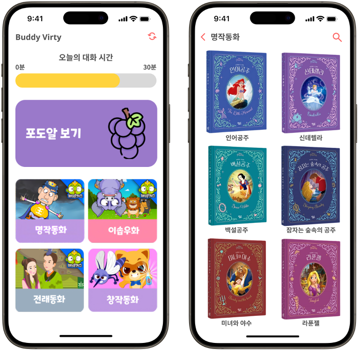
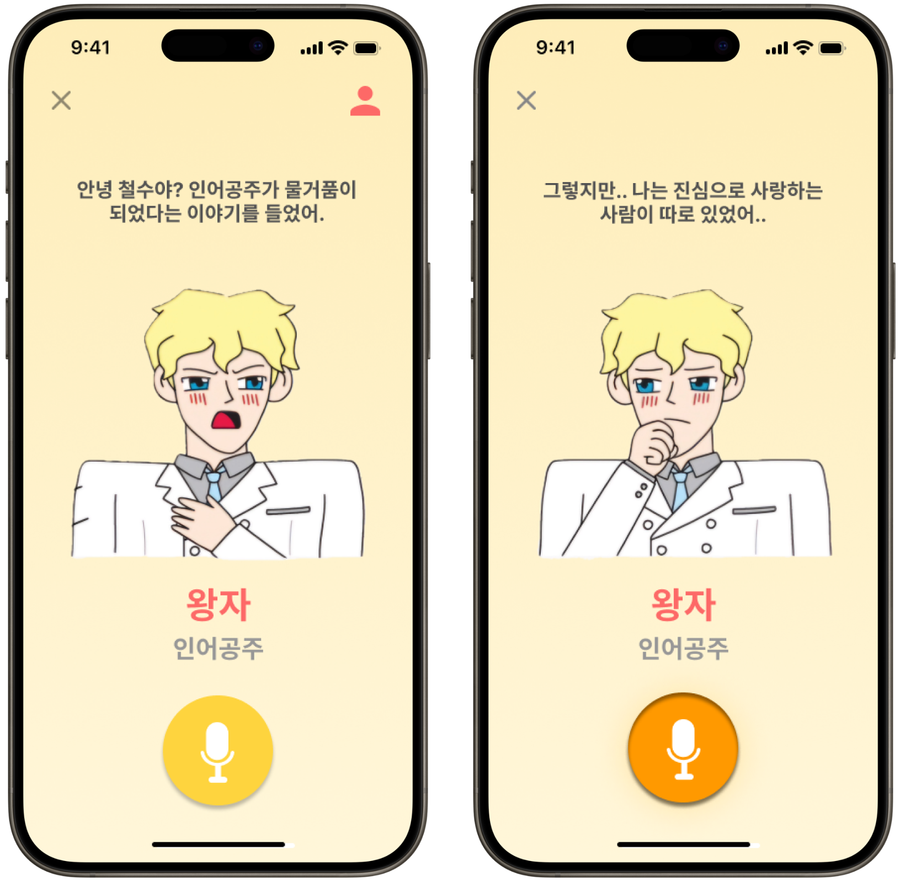
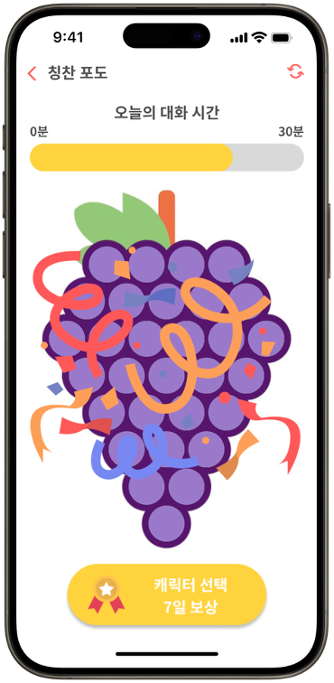
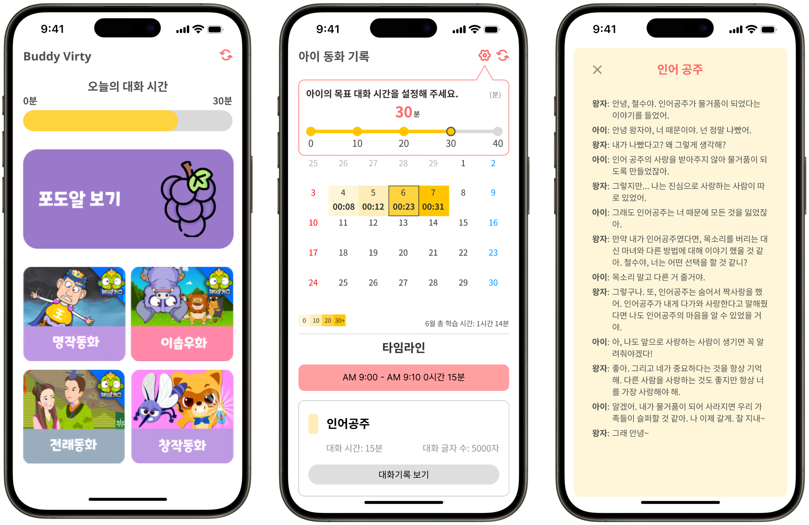

# 🧚 Buddy Virty (Buddy-Virtual-Teacher)
### *Fairy-tale with My buddy*
> "Welcome to the fairy tale world in your hands. Shall we become friends with the fairy tale characters?"

**Buddy Virty** is an interactive, voice-based fairy tale application designed for children aged 6 to 10. By enabling children to converse directly with characters from the books they've read, the app transforms reading from a passive activity into an engaging, interactive experience. This helps children build a consistent reading habit, expand their critical thinking skills, and develop empathy by communicating with characters from various perspectives.

---

## 🎯 Value Proposition & Target Audience

**Target Audience**: Children aged 6-10 who:
- Want to make reading more enjoyable.
- Need encouragement to think deeply beyond just reading text.
- Are eager to interact and communicate with fairy tale characters.

**Value Proposition**:
- Overcomes the passive consumption of digital media by inducing active and voluntary reading.
- Facilitates "Reading Discussions" through AI-powered fairy tale characters, enhancing children's creativity, emotional intelligence, and perspective-taking abilities.

---

## ✨ Key Features

### 1. Main Page & Fairy Tale Selection
The default mode upon launching the app provides a bookshelf-style interface where children can browse and select books.
- **Home Dashboard**: Displays the current progress against the daily conversation goal and provides easy access to the Grape Stamps reward page.
- **Categorized Bookshelf**: Browse books by categories including Aesop's fables, world masterpieces, traditional fairy tales, and more.
- **Search**: A search function to easily find specific books.

    

### 2. Voice Interaction with Characters
Children can choose a book they have read and start a conversation with a randomly assigned character from that story. 
- **AI-Powered Conversations**: User speech is converted to text via STT (Speech-to-Text), processed by ChatGPT with tailored prompt engineering, and delivered back as character-specific audio via TTS (Text-to-Speech).
- **Guided Thinking**: The AI character not only answers questions but proactively asks the child about their thoughts on the story to draw out deeper insights and convey moral lessons.
- **Interactive Experience**: The character features contextual animations and facial expressions to make the conversation feel natural and alive.

    

### 3. Grape Stamps Reward System
To keep children motivated, the app includes a visual reward system.
- Earning a daily grape stamp by completing the target conversation time.
- Collecting 30 grapes (a full bunch) unlocks a **7-Day Character Selection Pass**, allowing the child to freely choose their conversation partner instead of it being randomly assigned.

    

### 4. Parent Mode
A dedicated, password-protected mode for parents to manage and monitor their child's reading activities.
- **Goal Setting**: Set daily conversation time goals.
- **Monitoring**: Check the daily conversation history and read full conversation logs (transcripts) between the child and the AI characters.
- **Customization**: Adjust the child's profile (like age) so the AI can tailor its vocabulary and conversation level accordingly.

    

---

## 🛠 Tech Stack
- **Framework**: [Flutter](https://flutter.dev/)
- **AI/ML**: OpenAI ChatGPT API (for dynamic persona generation)
- **Audio Processing**: Speech-to-Text (STT), Text-to-Speech (TTS)

## 🚀 Getting Started

To run this project locally, ensure you have Flutter installed.

```bash
# Clone the repository
git clone https://github.com/your-username/Buddy-Virtual-Teacher.git

# Navigate into the directory
cd Buddy-Virtual-Teacher

# Install dependencies
flutter pub get

# Run the app
flutter run
```
